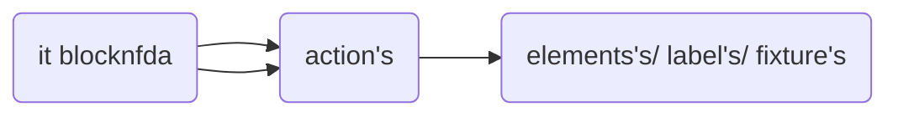

<h1 >Good to see you in cypress-testrail-boilerplate</h1>
<div >Rapidly create modern ventures, and start and begin coding quickly with an as of now pre-configured extend. Whereas utilizing this boilerplate you and your group can center more on coding, and less stress around setup. This boilerplate is full of valuable plugins as of now designed, and much more! Great good fortune!
</div>

</br>

## Setting up your project with few commands

### Installation Guide

Keep in mind, `my-application` name of your project but you can update while cloning this repository
```sh
npx git@github.com:tayyabsaleem7756/igni.git my-application
```

### Install dependencies</br>
First, move into project folder.
```sh
cd my-application

```
npm(node package manager) will automatically install all dependencies
```sh
npm install

```

### Create a new project

`project` refers to your project(name).

```sh
$ npm run add-project
```

This command will prompt you for your:

- **prodject** name
- **baseUrl** (e.g. www.mytestdomain.com)

The third confirmation is for `testrail configuration` if you want to configure so type y, 
- **Do you want configure testrail?'** (y/N)

### Setup almost Done !


The command from above would create the following structure and inject new scripts in package.json.

```
- core/pageObject
  - actions/
    - generalActions.js
    - pageActions.js
  - elements/
    - pageElements.js
  - labels/
    - pageLabels
    elements.js
    fixture.js
    labels.js
    pages.js
- e2e/
    - default.cy.js
- plugins/
    - index.js
- cypress.env.json
- cypress.config.js
```
This file structure explains below.

| file structure     |  description                                              |
| ------------------ |  -------------------------------------------------------- |
| `core/ pageObject` |   contains `objects modal` folder and file                |
| `actions/`         |   contains `action's` on page (e.g. verify, add, edit)    |
| `elements/`        |   contains `element's` on page                            |
| `labels/`          |   contains `label's` for elements                         |
| `elements.js`      |   cobimed `element's` of system will export in this file  |
| `fixture.js`       |   cobimed `element's` of system will export in this file  |
| `labels.js`        |   cobimed `label's` of system will export in this file    |
| `pages.js`         |   cobimed `action's` of system will export in this file   |

Best practice: create `separate files for each page/ section`  e.g. actions, elements, labels

### General actions 

There are numerous predefined actions's accessible, by utilizing these action's your code will be rapid and consistant. Some example are listed below

```js
const login = () => {
    return cy.adminLogin(Cypress.env('username'), Cypress.env('password'))
}
const clickButtonUsingLabel = (label) => {
    return cy.contains(label).should('be.visible').click({
        force: true
    })
}
const clickButtonUsingLocator = (locator) => {
    return cy.get(locator).should('be.visible').click({
        force: true
    })
}
const typeInDropdownInput = (dropdown_locator, text) => {
    return cy.get(dropdown_locator).click().type(`${text}{enter}`, {
        delay: 100
    })
}
const dragandDropUsingXpath = (value, value2) => {
    const dataTransfer = new DataTransfer();
    cy.xpath(value).trigger('dragstart', {
        dataTransfer
    });

    cy.get(value2).trigger('drop', {
        dataTransfer
    });
}
const clickButtonUsingXpath = (value) => {
    cy.xpath(value).click()
}
const canvasDragandDropUsingXpath = (value, x, y) => {
    cy.xpath(value)
        .trigger('mousedown').trigger("mousemove", {
            clientX: x,
            clientY: y
        })
        .trigger("mouseup")
}
const generalActions = {

    login,
    clickButtonUsingLabel,
    clickButtonUsingLocator,
    typeInDropdownInput,
    clickButtonUsingXpath,
    canvasDragandDropUsingXpath,
    dragandDropUsingXpath,
}

export default generalActions

```
Usage:

```js
import * as pages from '../pages'

describe('Visit', () => {
  it('Visit', () => {
    pages.generalActions.clickButtonUsingLocator(elements.pageElements.googleInput)
    pages.generalActions.typeInInput(elements.pageElements.googleInput, data.defaultData.input)
    pages.generalActions.clickButtonUsingLabel(labels.pageLabels.googleSearchLabel)
  })
})
```

In `fixture > project > projectENV.json` define your `baseUrl` and other URLs per each environment.

Preview

```json
{
  "staging": {
    "baseUrl": "https://example.com",
  },
  "release": {
    "baseUrl": "https://example.com"
  },
  "production": {
    "baseUrl": "https://example.com",
    "admin": "https://example.com/admin"
  }
}
```

Usage:

```js
import { projectENV } from '../../../support/helpers'

describe('Should visit admin', () => {
  it('Visit', () => {
    cy.visit(projectENV.admin)
  })
})
```

`projectENV` will always return URL from current set environment, which in this case, is `production`.

### fixtures/credentials.json

Here is the place to define your user's list, etc. users list for your tests.

By default, you can see

Preview

```json
{
  "staging": {
    "sampleUser1": {
      "name": "User name",
      "email": "test@cypress_template_test.com",
      "password": "user password"
    }
  },
  "release": {
    "sampleUser2": {
      "name": "User name",
      "email": "test@cypress_template_test.com",
      "password": "user password"
    }
  },
}
```

Usage:

```js
import { projectENV, credetials } from '../../../support/helpers'

describe('Should visit admin', () => {
  it('Visit and log in ', () => {
    cy.visit(projectENV.admin)
    cy.logIn(credetials.sampleUser2)
  })
})
```
------------------------------------------------------------

Here is a simple flow chart:

